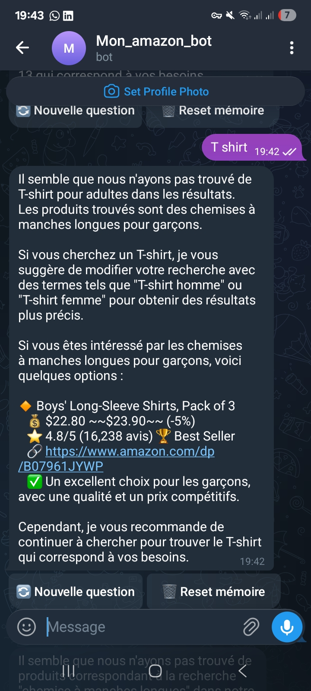
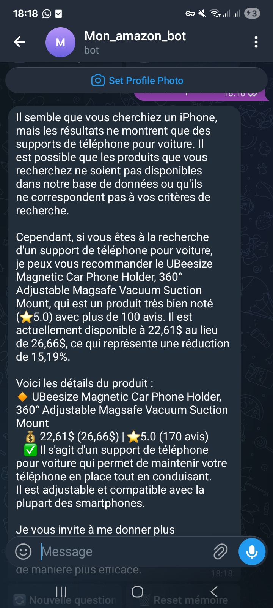
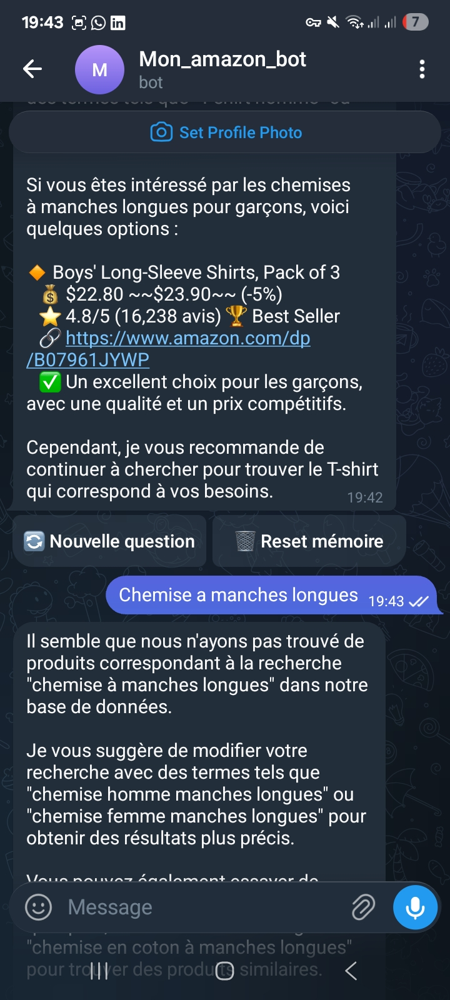

# 🤖 Telegram Amazon Bot

A Telegram bot that helps users find Amazon products through natural conversation. It understands plain-language queries (French or English), searches a local SQLite database of real Amazon products, and uses [Groq](https://groq.com/) (Llama 3) to generate friendly, context-aware recommendations.

## Demo

| Search with no exact match | Search with results | Refining a search |
|---|---|---|
|  |  |  |

## Features

- 🔍 **Smart product search** — fuzzy keyword + category matching over a local Amazon products dataset (SQLite), ranked by best-seller status, rating, and review count.
- 💬 **Natural language understanding** — detects greetings, questions, and product searches, and extracts price filters from phrases like `"laptop max:1000"` or `"shoes moins de 100"`.
- 🧠 **AI-generated responses** — Groq's Llama models write short, conversational replies and product recommendations based on real search results (no hallucinated products).
- 🗂️ **Per-user memory** — tracks search history, preferences (budget, favorite categories), and stats per Telegram user in SQLite.
- 📂 **Category browsing** — `/categories` lists the most popular product categories available.
- 📊 **User stats** — `/stats` shows a user's search count and history.

## Tech stack

- [python-telegram-bot](https://github.com/python-telegram-bot/python-telegram-bot) — Telegram Bot API
- [Groq](https://groq.com/) — LLM inference (Llama 3.1 / 3.3)
- SQLite — product catalog (`products.db`) and bot data (`shopping_bot.db`)

## Project structure

```
bot.py                    # Telegram handlers, intent detection, message formatting
ai_assistant.py           # AIAssistant class — Groq-powered conversational assistant
price_finder.py           # Product search engine over products.db
database.py               # Users, search history, and preferences (shopping_bot.db)
load_data.py               # Imports the Amazon products/categories CSV into products.db
clean_database.py         # Database maintenance/cleanup utility
config.py                 # Loads settings from .env
data/                      # Amazon products & categories CSV (not committed)
```

## Setup

1. **Clone and install dependencies**
   ```bash
   git clone https://github.com/radiaboujdid11/telegram-amazon-bot.git
   cd telegram-amazon-bot
   pip install -r requirements.txt
   ```

2. **Create a `.env` file**
   ```env
   BOT_TOKEN=your_telegram_bot_token
   GROQ_API_KEY=your_groq_api_key
   ADMIN_IDS=123456789
   ```

3. **Load the product data**

   Place `amazon_products.csv` and `amazon_categories.csv` in `data/`, then run:
   ```bash
   python load_data.py
   ```

4. **Run the bot**
   ```bash
   python bot.py
   ```

## Usage

Talk to the bot like you would a shopping assistant:

- `shirt blanc homme` — search for a product
- `laptop gaming max:1000` — search with a price cap
- `quelles sont les meilleures chaussures?` — ask a question
- `/categories` — browse available categories
- `/stats` — see your search history stats

## License

Personal/educational project — no license specified.
